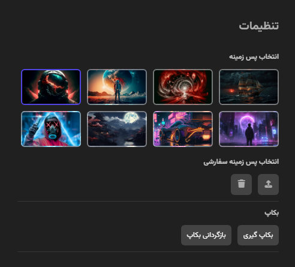

# Bookina - بوکینا

<div dir="rtl">

# بوکینا - داشبورد شخصی فارسی

بوکینا یک برنامه داشبورد شخصی مدرن و بهینه‌شده برای تب جدید مرورگر کروم است که با طراحی شیشه‌ای (Glassmorphism) و رابط کاربری فارسی توسعه یافته است.


## ✨ ویژگی‌ها

### 📅 تقویم فارسی
- نمایش تقویم جلالی (شمسی) با قابلیت ناوبری ماه‌ها
- هایلایت کردن تاریخ امروز
- نمایش نام روزهای هفته به فارسی
- اعداد فارسی در تمام بخش‌ها

### 📝 مدیریت وظایف (Todo)
- افزودن و حذف تسک‌ها
- علامت‌گذاری تسک‌های انجام شده
- رابط کاربری ساده و سریع

### 🔖 مدیریت بوکمارک‌ها
- افزودن، ویرایش و حذف بوکمارک
- نمایش favicon سایت‌ها
- قابلیت Drag & Drop برای مرتب‌سازی
- ذخیره‌سازی خودکار

### 🌦 وضعیت آب و هوا
- نمایش وضعیت آب و هوا برای شهرهای مختلف ایران
- قابلیت انتخاب شهر (قزوین، تهران، مشهد، اصفهان، تبریز، شیراز)
- اطلاعات دما و شرایط جوی

### 📰 اخبار
- نمایش آخرین اخبار
- قابلیت رفرش اطلاعات
- طراحی کارت‌های خبری

### 📌 یادداشت‌های چسبان (Sticky Notes)
- ایجاد یادداشت‌های رنگی
- قابلیت Drag & Drop
- ذخیره‌سازی خودکار
- انتخاب از بین ۱۲ رنگ مختلف


### ⚙️ تنظیمات
- انتخاب تصویر پس‌زمینه از بین ۸ گزینه
- سیستم پشتیبان‌گیری و بازیابی
- ذخیره‌سازی تمام تنظیمات
- انتخاب تصویر پس‌زمینه سفارشی از سیستم کاربر

<div align="center">
  
</div>

### 🕐 ساعت آنالوگ
- نمایش ساعت آنالوگ زیبا
- طراحی شیشه‌ای هماهنگ با کل برنامه

## 🚀 نصب و راه‌اندازی

### نصب به عنوان افزونه کروم

1. فایل پروژه را دانلود کنید
2. مرورگر کروم را باز کنید و به آدرس `chrome://extensions/` بروید
3. گزینه «Developer mode» را از گوشهٔ بالا سمت راست فعال کنید
4. روی "Load unpacked" کلیک کنید و پوشه پروژه را انتخاب کنید
5. افزونه بوکینا نصب شده و در تب جدید نمایش داده می‌شود

### اجرا به عنوان برنامه وب

1. فایل `index.html` را در مرورگر باز کنید
2. برنامه به صورت مستقیم اجرا می‌شود

## 🏗 معماری فنی

### ساختار ماژولار
```
src/
├── main.js              # نقطه ورود اصلی برنامه
├── modules/
│   ├── bookmarks.js     # مدیریت بوکمارک‌ها
│   ├── todos.js         # مدیریت تسک‌ها
│   ├── calendar.js      # تقویم فارسی
│   ├── weather.js       # وضعیت آب و هوا
│   ├── news.js          # نمایش اخبار
│   ├── stickyNotes.js   # یادداشت‌های چسبان
│   └── settings.js      # تنظیمات
└── utils/
    ├── storage.js       # مدیریت ذخیره‌سازی
    ├── date.js          # ابزارهای تاریخ فارسی
    └── dom.js           # ابزارهای DOM
```

### تکنولوژی‌ها
- **HTML5** - ساختار صفحه
- **CSS3** - استایل‌دهی با طراحی Glassmorphism
- **JavaScript ES6+** - منطق برنامه
- **Chrome Extension API** - یکپارچه‌سازی با مرورگر
- **Modular JavaScript** - معماری ماژولار

### API‌های استفاده شده
- Chrome Storage API برای ذخیره‌سازی داده‌ها
- Weather API برای اطلاعات آب و هوا
- News API برای دریافت اخبار

## 🔧 توسعه

### پیش‌نیازها
- مرورگر کروم
- ویرایشگر کد (VS Code پیشنهاد می‌شود)

### ساختار توسعه
```javascript
// نمونه کد ماژول
export class ModuleManager {
  constructor() {
    // مقداردهی اولیه
  }

  async initialize() {
    // راه‌اندازی ماژول
  }

  // متدهای عمومی
}
```

### افزودن ماژول جدید
1. فایل جدید در پوشه `src/modules/` ایجاد کنید
2. کلاس ماژول را با متد `initialize` بسازید
3. ماژول را در `src/main.js` import کنید
4. ماژول را در تابع `initializeModules` اضافه کنید

## 📦 فایل‌های مهم
- `index.html` - ساختار اصلی صفحه
- `manifest.json` - تنظیمات افزونه کروم
- `src/main.js` - نقطه ورود برنامه
- `styles.css` - استایل‌های اصلی
- `src/utils/` - ابزارهای کمکی

## 🤝 مشارکت
برای مشارکت در توسعه بوکینا:
1. پروژه را Fork کنید
2. Branch جدید ایجاد کنید (`git checkout -b feature/amazing-feature`)
3. تغییرات را Commit کنید (`git commit -m 'Add amazing feature'`)
4. به Branch اصلی Push کنید (`git push origin feature/amazing-feature`)
5. Pull Request ایجاد کنید

## 📄 لایسنس
این پروژه تحت لایسنس MIT منتشر شده است.

## 📞 پشتیبانی
برای گزارش باگ یا پیشنهاد ویژگی جدید، لطفاً از بخش Issues در گیت‌هاب استفاده کنید.

---

</div>

