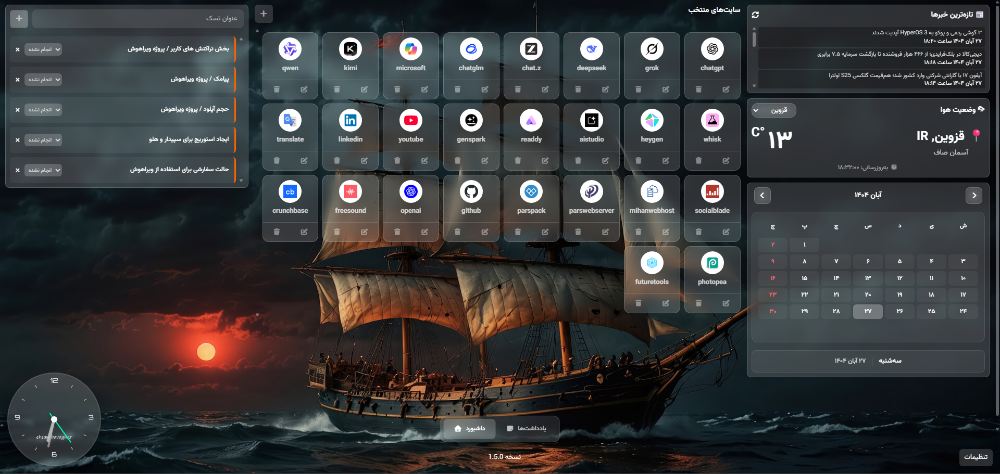

# 📚 بوکینا - اکستنشن داشبورد شخصی برای کروم ، ادج و ...


یک داشبورد شخصی و صفحه جدید (New Tab) زیبا و کاربردی برای مرورگر کروم که امکانات مختلفی را در یک مکان جمع‌آوری کرده است.





## ✨ ویژگی‌ها

### 🔖 مدیریت بوکمارک‌ها
- افزودن، ویرایش و حذف بوکمارک‌ها
- نمایش favicon خودکار
- قابلیت Drag & Drop برای مرتب‌سازی
- ذخیره‌سازی در حافظه مرورگر

### ✅ لیست کارها (To-Do)
- ایجاد تسک‌های جدید
- مدیریت وضعیت‌ها (انجام نشده، در حال انجام، انجام شده)
- رنگ‌بندی وضعیت‌ها
- ذخیره‌سازی محلی

### 📅 تقویم شمسی
- نمایش تقویم کامل شمسی
- ناوبری بین ماه‌های قبل و بعد
- هایلایت تاریخ امروز
- رنگ‌آمیزی جمعه‌ها به عنوان روز تعطیل
- محاسبات دقیق سال‌های کبیسه

### ⏰ آلارم و یادآوری
- تنظیم آلارم‌های متعدد
- پخش صدای هشدار
- اعلان‌های مرورگر
- ویرایش و حذف آلارم‌ها

### 🌤️ وضعیت آب و هوا
- نمایش وضعیت آب و هوا برای شهرهای مختلف ایران
- اطلاعات کامل شامل دما، رطوبت، سرعت باد
- انتخاب شهر از لیست
- به‌روزرسانی خودکار

### 📰 اخبار فوری
- دریافت آخرین اخبار از منابع معتبر
- نمایش تیتر اخبار
- لینک مستقیم به خبر
- قابلیت به‌روزرسانی دستی

### 📝 استیکی نوت
- ایجاد یادداشت‌های چسبنده
- قابلیت Drag & Drop
- تغییر رنگ یادداشت‌ها
- ذخیره‌سازی موقعیت و محتوا

### 🎨 تنظیمات ظاهری
- انتخاب از بین ۸ تصویر پس‌زمینه
- ذخیره‌سازی تنظیمات
- رابط کاربری Glassmorphism
- پشتیبانی از RTL و فونت فارسی

## 🚀 نصب و راه‌اندازی

### روش ۱: نصب از Chrome Web Store
(به زودی در دسترس خواهد بود)

### روش ۲: نصب دستی

1. دانلود یا کلون پروژه:
```bash
git clone https://github.com/your-username/bookina.git
```

2. باز کردن مرورگر کروم و رفتن به آدرس:
```
chrome://extensions/
```

3. فعال کردن حالت Developer Mode (در گوشه سمت راست بالا)

4. کلیک روی "Load unpacked" و انتخاب پوشه پروژه

5. اکنون افزونه نصب شده و می‌توانید از آن استفاده کنید

## 🏗️ ساختار پروژه

```
bookina/
├── index.html              # صفحه اصلی
├── manifest.json           # فایل پیکربندی افزونه
├── styles.css              # استایل‌های اصلی
├── script.js               # منطق اصلی برنامه
├── alarm.mp3               # صدای آلارم
├── css/
│   └── clock.css          # استایل‌های ساعت (اگر موجود باشد)
├── js/
│   ├── clock.js           # منطق ساعت (اگر موجود باشد)
│   ├── jquery-3.6.0.slim.min.js
│   └── jquery-ui.min.js
├── icons/
│   ├── icon16.png
│   ├── icon48.png
│   └── icon128.png
├── images/
│   ├── bg1.jpg تا bg8.jpg # تصاویر پس‌زمینه
│   └── clock.png
└── README.md
```

## 🛠️ فناوری‌های استفاده شده

- **HTML5** - ساختار صفحات
- **CSS3** - استایل‌دهی با Glassmorphism
- **JavaScript (ES6+)** - منطق برنامه
- **Chrome Extension API** - یکپارچه‌سازی با مرورگر
- **Local Storage** - ذخیره‌سازی داده‌ها
- **Fetch API** - دریافت داده از APIهای خارجی

## 🔧 APIهای استفاده شده

### آب و هوا
- **سرویس:** OpenWeatherMap
- **شهرهای پشتیبانی شده:** تهران، مشهد، اصفهان، شیراز، تبریز، کرج، قم، اهواز

### اخبار
- **منبع:** Zoomit.ir
- **فرمت:** RSS Feed
- **تعداد اخبار:** ۱۰ خبر آخر

## 📋 امکانات آینده

- [ ] پشتیبانی از تم‌های تاریک و روشن
- [ ] همگام‌سازی با ابر (Cloud Sync)
- [ ] ویجت ساعت و تاریخ
- [ ] تبدیل واحدهای مختلف
- [ ] یادآوری رویدادها
- [ ] پشتیبانی از زبان‌های دیگر
- [ ] حالت فشرده (Compact Mode)

## 🐛 گزارش مشکل

اگر با مشکلی مواجه شدید، لطفاً از طریق بخش Issues در GitHub گزارش دهید.

## 🤝 مشارکت

مشارکت‌های شما همیشه مورد استقبال است! لطفاً:

1. پروژه را Fork کنید
2. Branch جدید ایجاد کنید (`git checkout -b feature/AmazingFeature`)
3. تغییرات را Commit کنید (`git commit -m 'Add some AmazingFeature'`)
4. به Branch اصلی Push کنید (`git push origin feature/AmazingFeature`)
5. یک Pull Request ایجاد کنید

## 📄 مجوز

این پروژه تحت مجوز MIT منتشر شده است - برای جزئیات بیشتر فایل [LICENSE](LICENSE) را مشاهده کنید.

## 👨‍💻 توسعه‌دهنده

- **نام:** Bookina Team
- **ایمیل:** contact@bookina.com
- **وب‌سایت:** https://bookina.com

## 🙏 تشکر و قدردانی

- از جامعه متن‌باز برای ابزارها و کتابخانه‌های ارزشمند
- از OpenWeatherMap برای ارائه API آب و هوای رایگان
- از Zoomit.ir برای ارائه فید RSS اخبار

---

**توجه:** این پروژه یک افزونه شخصی است و برای استفاده تجاری نیاز به مجوز دارد.

⭐ اگر این پروژه را دوست دارید، لطفاً آن را در GitHub ستاره دهید!


# 📚 Bookina - Personal Dashboard Extension

A beautiful and functional personal dashboard and new tab page for Chrome browser that brings various features together in one place.


## ✨ Features

### 🔖 Bookmark Management
- Add, edit, and delete bookmarks
- Automatic favicon display
- Drag & Drop for organization
- Storage in browser memory

### ✅ To-Do List
- Create new tasks
- Manage statuses (Not Started, In Progress, Completed)
- Color-coded statuses
- Local storage

### 📅 Persian Calendar
- Complete Persian calendar display
- Navigation between previous and next months
- Today's date highlighting
- Fridays colored as holidays
- Accurate leap year calculations

### ⏰ Alarm & Reminders
- Set multiple alarms
- Play alarm sound
- Browser notifications
- Edit and delete alarms

### 🌤️ Weather Status
- Display weather for different cities in Iran
- Complete information including temperature, humidity, wind speed
- City selection from list
- Automatic updates

### 📰 Breaking News
- Get latest news from reliable sources
- Display news headlines
- Direct links to news
- Manual refresh capability

### 📝 Sticky Notes
- Create sticky notes
- Drag & Drop functionality
- Note color customization
- Position and content storage

### 🎨 Appearance Settings
- Choose from 8 background images
- Settings storage
- Glassmorphism UI
- RTL and Persian font support

## 🚀 Installation & Setup

### Method 1: Install from Chrome Web Store
(Coming soon)

### Method 2: Manual Installation

1. Download or clone the project:
```bash
git clone https://github.com/your-username/bookina.git
```

2. Open Chrome browser and go to:
```
chrome://extensions/
```

3. Enable Developer Mode (top right corner)

4. Click "Load unpacked" and select the project folder

5. The extension is now installed and ready to use

## 🏗️ Project Structure

```
bookina/
├── index.html              # Main page
├── manifest.json           # Extension configuration file
├── styles.css              # Main styles
├── script.js               # Main application logic
├── alarm.mp3               # Alarm sound
├── css/
│   └── clock.css          # Clock styles (if exists)
├── js/
│   ├── clock.js           # Clock logic (if exists)
│   ├── jquery-3.6.0.slim.min.js
│   └── jquery-ui.min.js
├── icons/
│   ├── icon16.png
│   ├── icon48.png
│   └── icon128.png
├── images/
│   ├── bg1.jpg to bg8.jpg # Background images
│   └── clock.png
└── README.md
```

## 🛠️ Technologies Used

- **HTML5** - Page structure
- **CSS3** - Styling with Glassmorphism
- **JavaScript (ES6+)** - Application logic
- **Chrome Extension API** - Browser integration
- **Local Storage** - Data storage
- **Fetch API** - External API data retrieval

## 🔧 APIs Used

### Weather
- **Service:** OpenWeatherMap
- **Supported Cities:** Tehran, Mashhad, Isfahan, Shiraz, Tabriz, Karaj, Qom, Ahvaz

### News
- **Source:** Zoomit.ir
- **Format:** RSS Feed
- **News Count:** Latest 10 news items

## 📋 Future Features

- [ ] Dark and light theme support
- [ ] Cloud synchronization
- [ ] Clock and date widget
- [ ] Unit conversion
- [ ] Event reminders
- [ ] Multi-language support
- [ ] Compact Mode

## 🐛 Bug Reporting

If you encounter any issues, please report them via the Issues section on GitHub.

## 🤝 Contribution

Your contributions are always welcome! Please:

1. Fork the project
2. Create a new branch (`git checkout -b feature/AmazingFeature`)
3. Commit your changes (`git commit -m 'Add some AmazingFeature'`)
4. Push to the branch (`git push origin feature/AmazingFeature`)
5. Create a Pull Request

## 📄 License

This project is released under the MIT License - see the [LICENSE](LICENSE) file for details.

## 👨‍💻 Developer

- **Name:** Bookina Team
- **Email:** contact@bookina.com
- **Website:** https://bookina.com

## 🙏 Acknowledgments

- Open source community for valuable tools and libraries
- OpenWeatherMap for providing free weather API
- Zoomit.ir for providing RSS news feed

---

**Note:** This project is a personal extension and requires a license for commercial use.

⭐ If you like this project, please give it a star on GitHub!

---
**فارسی | English**

این فایل README به دو زبان فارسی و انگلیسی ارائه شده است.